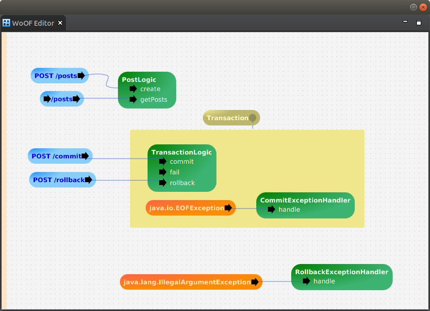

 
 

 
 
 
 

 
 
 

# OfficeFloor

OfficeFloor - inversion of coupling control

> Inversion of Control = Dependency Injection + Continuation Injection + Thread Injection

More information available at [http://officefloor.net](http://officefloor.net)

## Inversion of Coupling Control

OfficeFloor completes inversion of control by adding two new paradigms:

* **Continuation Injection**: to inject functions to orchestrate application behaviour
* **Thread Injection**: to inject/select thread (pools) to execute particular functions
* *Dependency (State) Injection*: to inject objects for state into functions (currently only paradigm implemented by "inversion of control" frameworks)
 
In doing this, OfficeFloor is capable of running different threading models (e.g. both asynchronous single threaded and synchronous multi-threaded).  In actual fact, OfficeFloor opens up mixing the threading models within the application and even introduces ability for taking advantage of thread affinity to CPUs.

This follows OfficeFloor modeling people in an office environment.  As per the paper [OfficeFloor: using office patterns to improve software design](http://doi.acm.org/10.1145/2739011.2739013) ( [free download here](http://www.officefloor.net/about.html) ), OfficeFloor follows:

* Office being an application that makes decisions on information
* Tasks within the Office as functions/methods (weaved together with *Continuation Injection*)
* Office employees/workers as threads that undertake the functions/methods (assigned via *Thread Injection*)
* Forms being the objects (manage state via *Dependency Injection*)

This allows OfficeFloor to better align to how business processes actually work:

* Workers synchronously working through tasks/functions of the processes
* Workers working asynchronously with each other

In other words, people think/behave synchronously but organise asynchronously.  Hence, both thread models are in play in modelling business processes.  Furthermore, OfficeFloor makes development of asynchronous applications easier.  This is achieved by allowing the developer to avoid asynchronous coding by having synchronous functions co-ordinated asynchronously (just like workers above).

Further to this, graphical configuration is used.  An example configuration is as follows:

